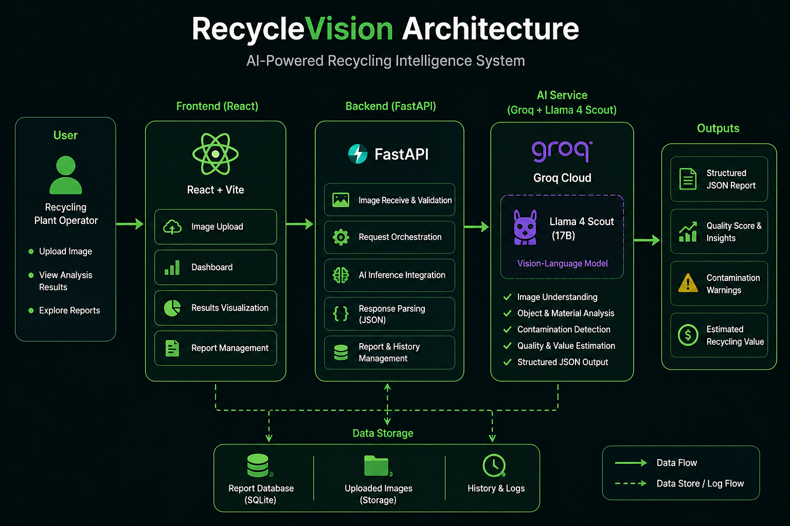
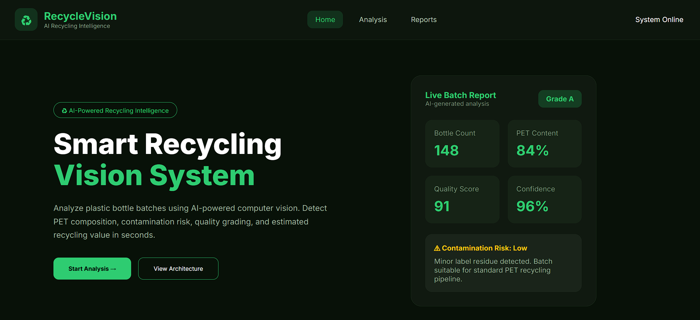
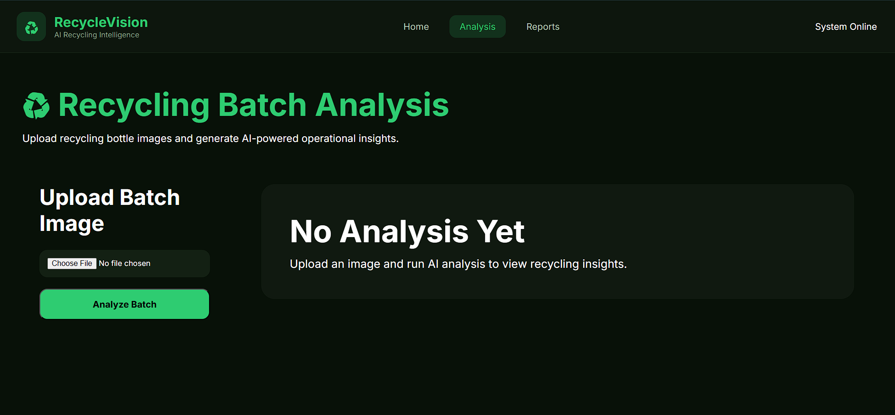
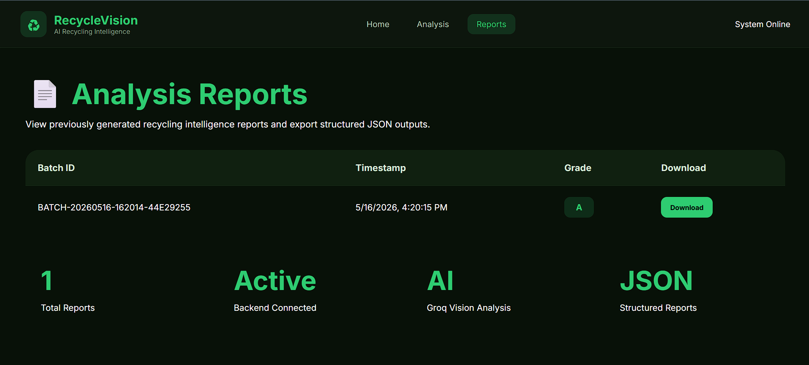

# ♻ RecycleVision

AI-powered recycling intelligence platform using multimodal vision-language models.

RecycleVision analyzes recycling bottle batches using AI and generates operational insights such as:
- Bottle count estimation
- PET vs Non-PET composition
- Contamination analysis
- Quality grading
- Confidence scoring
- Estimated recycling value
- Structured JSON reports

---

# 🚀 Features

- AI-powered recycling image analysis
- Bottle count estimation
- PET classification and quality scoring
- Contamination risk assessment
- FastAPI backend architecture
- React frontend dashboard
- Groq Vision API integration
- SQLite database integration
- JSON report generation
- Downloadable reports
- Responsive modern UI
- Architecture visualization popup

---

# 🧠 Technologies Used

## Frontend
- React
- Vite
- React Router DOM
- CSS

## Backend
- FastAPI
- Python
- SQLAlchemy
- SQLite

## AI / Vision
- Groq API
- Llama 4 Scout Vision Model

---

# 🏗 System Architecture



---

# 🖥 Application Screenshots

## Home Page



---

## Analysis Dashboard



---

## Reports Page



---

# 📂 Project Structure

```text
recyclevision/
│
├── frontend/
│   ├── public/
│   ├── src/
│   ├── package.json
│   └── ...
│
├── backend/
│   ├── api.py
│   ├── analyzer.py
│   ├── database.py
│   ├── requirements.txt
│   ├── uploads/
│   ├── sample_outputs/
│   └── reports.db
│
├── screenshots/
└── README.md
```

---

# ⚙️ Setup Instructions

## 1️⃣ Clone Repository

```bash
git clone <repo-url>

cd recyclevision
```

---

# 2️⃣ Frontend Setup

```bash
cd frontend

npm install

npm run dev
```

Frontend runs at:

```text
http://localhost:5173
```

---

# 3️⃣ Backend Setup

Open another terminal:

```bash
cd backend

pip install -r requirements.txt
```

Create `.env`

```env
GROQ_API_KEY=your_groq_api_key
```

Run backend:

```bash
uvicorn api:app --reload
```

Backend runs at:

```text
http://127.0.0.1:8000
```

---

# 📊 Workflow

1. User uploads recycling image
2. Frontend sends image to FastAPI backend
3. Backend processes image
4. Image sent to Groq Vision API
5. AI model generates recycling analysis
6. Backend stores reports in SQLite database
7. JSON reports are generated
8. Frontend displays operational dashboard

---

# 🗄 Database Integration

RecycleVision uses SQLite for storing:
- Batch IDs
- Bottle counts
- PET composition
- Quality scores
- Contamination risks
- Confidence scores
- Timestamps

This enables persistent report tracking and retrieval.

---

# 📄 Generated Outputs

The platform generates:
- AI-powered operational dashboards
- Structured JSON analysis reports
- Database records
- Downloadable reports

---

# ⚠️ Limitations

- Bottle counting is estimation-based
- Vision-language models may not provide exact object detection precision
- Current implementation uses multimodal reasoning instead of dedicated detection models like YOLO or Mask R-CNN

---

# 🔮 Future Improvements

- YOLO-based object detection
- Image segmentation models
- OCR for bottle label extraction
- Historical analytics dashboard
- Authentication system
- Cloud database integration
- Real-time monitoring pipeline
- Batch optimization

---

# 📌 Design Choices & Trade-offs

The project primarily uses a pretrained Vision-Language Model through the Groq API using Meta’s Llama 4 Scout multimodal model.

This approach was selected because:
- Rapid implementation
- No custom dataset training required
- Flexible semantic reasoning
- Faster development cycle
- Easier deployment

Trade-offs:
- Approximate object counting
- Less precise than dedicated object detection pipelines
- Semantic estimation instead of geometric detection

---

# 👨‍💻 Author

Tanniru Varun
